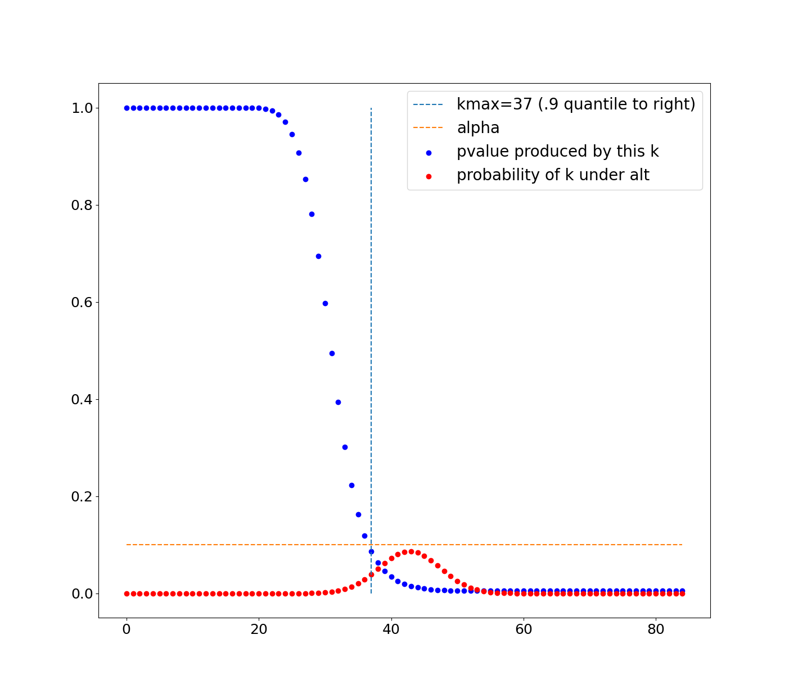
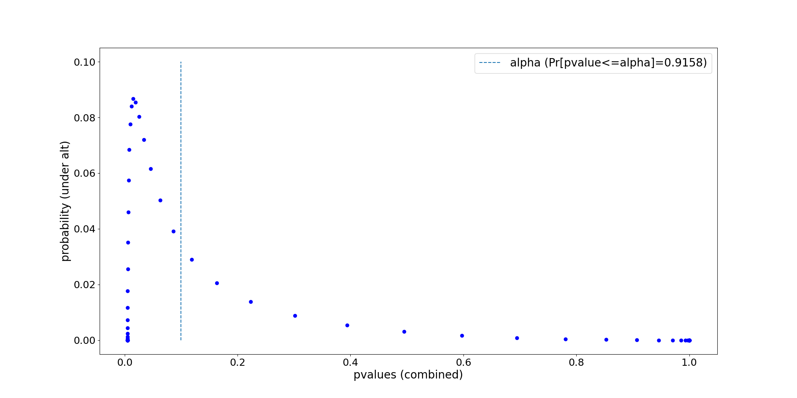
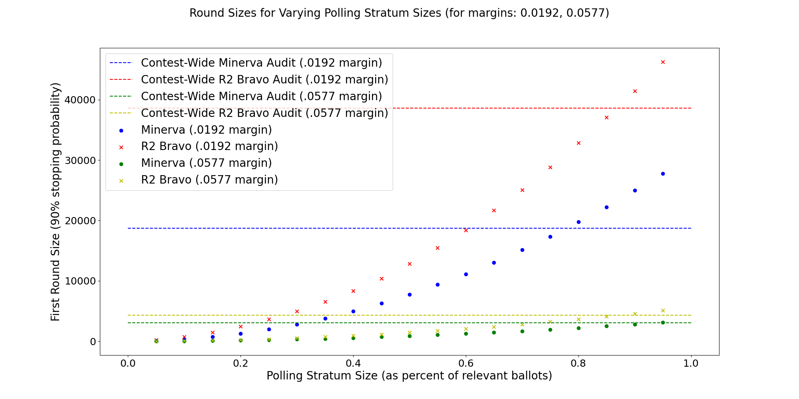
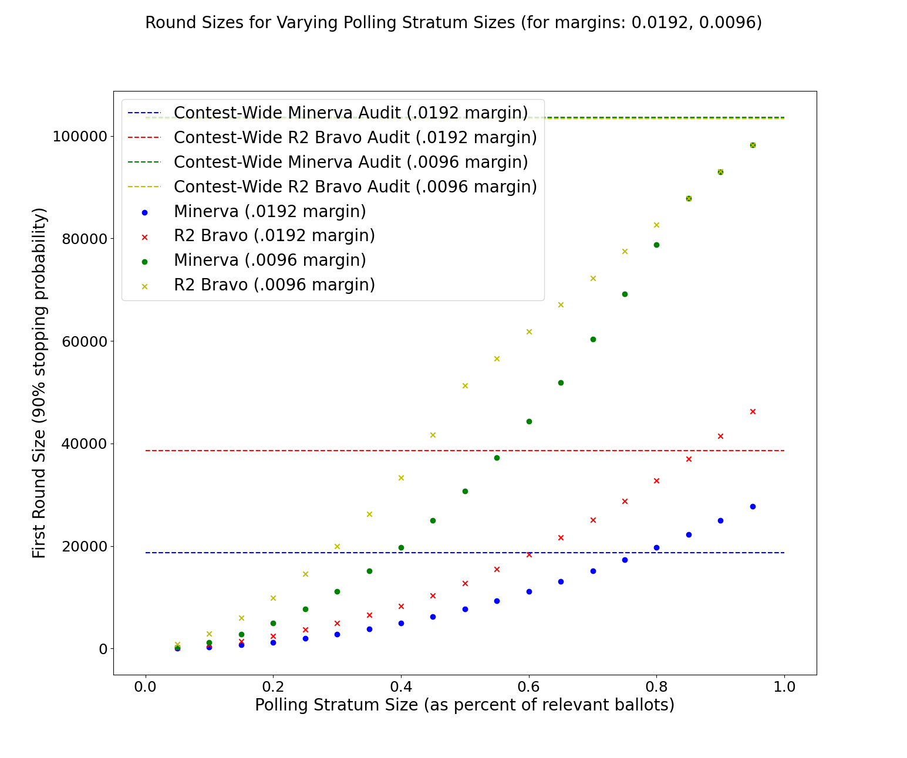
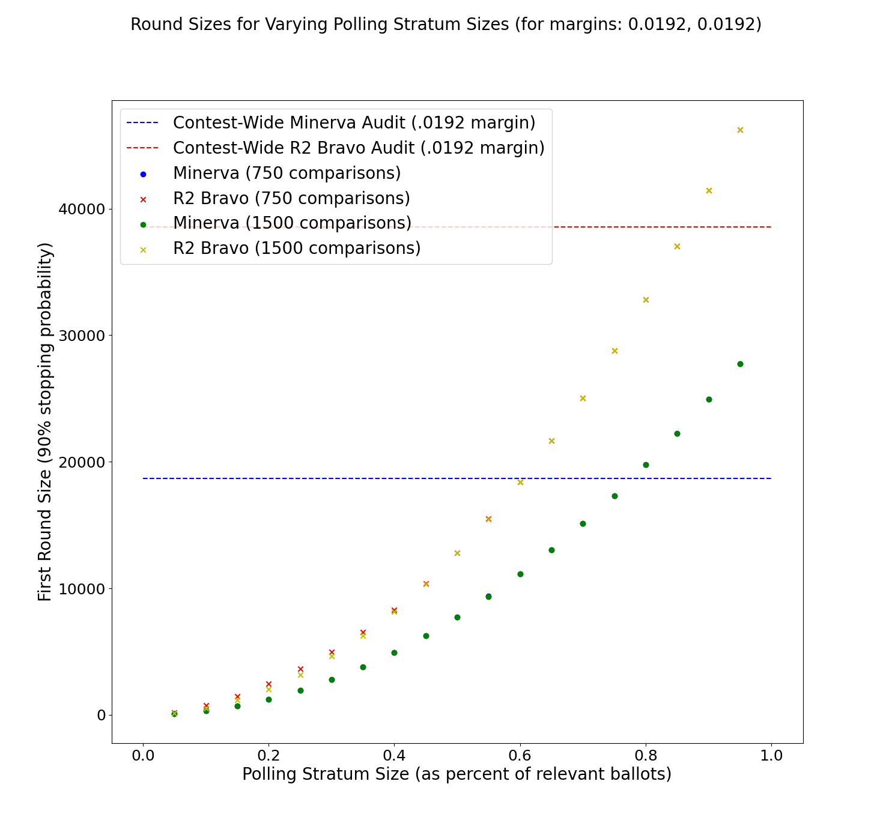
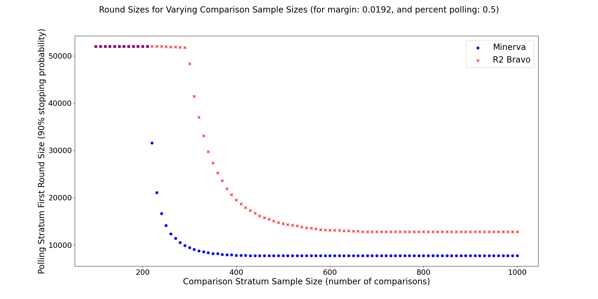

# stratified_athena

This repository is my exploratory work on stratified audits, under Professor Vora. Specifically I'm working on 2-strata audits that make use of the Athena class of ballot polling audits for the ballot polling stratum in order to increase the efficiency (and therefore feasability) of stratified audits.

A lot of this code is pulled straight from [the SUITE work](https://github.com/pbstark/CORLA18/tree/master/code) and some is pulled from [the minerva branch of r2b2](https://github.com/gwexploratoryaudits/r2b2/tree/minerva).

This code is messy and ugly. For now I more focused on getting things working and producing meaningful results, less focused on code ready to be integrated into r2b2....

Please ask me any questions that come up. obroadrick@gwu.edu

# Examples

## Finding round sizes

Here is a plot illustrating the method I use to find the polling stratum round size that achieves a desired probability of stopping. Plotted over possible values for k (winner votes drawn in the round) are both the combined pvalue produced by that k (using 2-strata SUITE with Minerva for the polling stratum and a fixed 750 comparisons) as well as the probability of that k under the alternative hypothesis (a binomial distribution centered around the announced tally for the winner. All the numbers are based on the first example SUITE uses, a relatively tight margin of .0192.

From the plot, you can tell that this round size of 84 achieves a 90% probability of stopping because the value kmax such that Pr[k>=kmax | H_a] >= .9 and the pvalue corresponding to kmax <= .1 = alpha, and as k increases from kmax, the pvalue only decreases. Another interesting way to look at this is a probability distribution over possible combined pvalues for the given round sizes as seen in the not-so-well-labelled graph below.

## Round sizes for various polling stratum sizes

Here is a plot of the ballot polling stratum minimum first round sizes that achieve 90% stopping probability for a 2-strata audit with ~2% margin, a fixed 750 ballots sampled in the comparison stratum, and various stratum sizes (on x-axis as percantage of total relevant ballots). Note that the 2-strata audit can reduce the number of ballots polled if a contest-wide polling audit were performed for significant polling stratum sizes (over half in this example). A tighter margin reduces the polling stratum size that still yields gains in efficiency, but even for this relatively tight race (~2% margin) more than half the relevant ballots can be in the polling stratum and still reduce the polling round size.

## Variables that affect round size
Below are the results of test in which I used the same numbers as in the previous example, but I have isolated and changed one variable to see how the round size is affected.

### Round sizes: larger margin
For even a small increase in margin, the polling stratum first round sizes are reduced significantly. The plot below allows you to compare the ~2% margin with a ~6% margin. As seen, the larger margin round sizes do not exceed their contest-wide counterparts until they reach a higher polling stratum size. For wider margins, 2-strata audits can reduce required sample sizes for even larger polling stratum sizes, whereas for tigher margins smaller polling stratum sizes are required to reap the benefits of the 2-strata audit.

### Round sizes: smaller margin
Round sizes for a contest with ~1% margin are shown on the plot below to be compared to the ~2% margin contest. There appears to be an issue with this data: see [the raw json data itself](data/data_stratified_smaller_margin.txt) if interested in taking a look at my weird results.

### Round sizes: higher comparison stratum sample
While it is reasonable to expect that increasing the number of comparisons would decrease the required polling sample size, this is often not the case. For relatively high perctentage polling stratum sizes, the SUITE overstatement error allocation, lambda, is 0. Therefore, increasing the sample size in the comparison stratum doesn't actually reduce the comparison stratum pvalue, rather it remains near 1, while the pressure of handling the whole of the error is left to the less efficient polling stratum. The following plot of the same contest round sizes for both the original 750 ballot comparison sample as well as a 1500 ballot comparison sample illustrates the point. While a reduction in round size is seen for small polling stratum sizes, the rest of the round sizes are the same for both 750 comparisons and 1500 comparisons.

### Affect of number of comparisons on polling sample size
As seen in the previous graph, for a sufficient number of comparisons, increasing the number of comparisons no longer decreases the polling stratum first round size. For such audits, lambda = 0 and all overstatement error is allocated to the polling stratum. Below is a plot of polling stratum first round size for various comparison sample sizes. Such a plot can be used to determine roughly the minimum comparison sample size required to achieve lambda = 0, thus minimizing the polling stratum sample size with as few comparisons as possible.

# Files in this repo (updated periodically)
###  audit_s.py
Audit class from r2b2, modified to handle null hypotheses of any margin. 

### ballot_comparison.py
Ballot comparison file from SUITE.

### contest.py
Contest file from r2b2.

### contest_wide_round_size_script.py
Script for computing and storing the round size for contest-wide ballot polling audits with no stratification (both Minerva and R2 Bravo).

### data
Directory with json files containing results from various tests, simulations, and computations of round sizes.

### dist_pvalues.py
Incomplete script for creating a plot of the probability distribution over possible pvalues for a stratified audit.

### easy_read.py
Simple script for printing data from the json data files.

### election.py
Election file from r2b2.

### fishers_combination.py
Fishers combination functions from SUITE.

### hypergeometric.py
Hypergeometric functions from SUITE. (Not used?)

### minerva_s.py
Minerva file from r2b2 modified to handle a null hypothesis with nonzero margin.

### old
Some files that are no longer used from when I first started exploring this topic, including some functions (incomplete) for more than two strata.

### plot_data.py
Script that produces a plot of round sizes from the json data files.

### pvalue_dist_script.py
Incomplete script that creates a plot of the probability distribution over pvalues for a stratified audit.

### __pycache__
This is a python thing.

### README.md
This file.

### round_sizes.py
Functions for computing a first round size which accomplishes a given probability of stopping under the alternative hypothesis, that the election is truly as announced.

### simulations.py
Functions for simulating stratified audits. Also includes my own functions for computing the pvalue for one-round Minerva audits and R2 Bravo audits.

### simulation_script.py
Script for running simulations of stratified audits.

### sprt.py
Functions for R2 Bravo from SUITE.

### stratified_round_size_script.py
Script to compute the round size which accomplishes a given probability of stopping for various one-round stratified audits.

